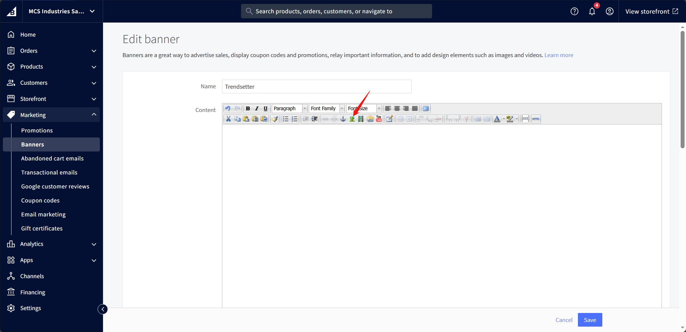

#  Page
The brand page lists all the products in the brand.

## Banner

Navigate to <a href="https://store-pyabsa1eqo.mybigcommerce.com/manage/marketing/banners">marketing banners</a> on the bigcommerce dashboard, and click create a banner:

Fill in the name of the banner, and in the content area, add two images with a page break in between them, first image is for desktop and second image is for mobile:

Once the image is visible in the content area, press enter to ensure the cursor is where is show in the below image:

Once the page break is visible, again press enter to break new link and insert the mobile image:

Finally, the content block would look something like this:

The rest of the options on the page can be selected as follow, please make sure the location is set to one of the brands:

## Title and Description
It contains the brand name and description.

We used the built-in BigCommerce brand settings for this.

To edit it, go to the brand settings in BigCommerce.

## Filters
The filters are used to filter the products based on the price, brand, and other custom fields.

We used the built-in BigCommerce filters and custom fields for this.

You can see all the available filters going to the 'Filtering' settings in BigCommerce by selecting 'All filters'. You can then select the filters you want to show on the brand page.

For more information about the filters, see the <a href="https://support.bigcommerce.com/s/article/Product-Filtering-Settings" target="_blank">BigCommerce documentation</a>.

## Products
It lists all the products in the brand.

