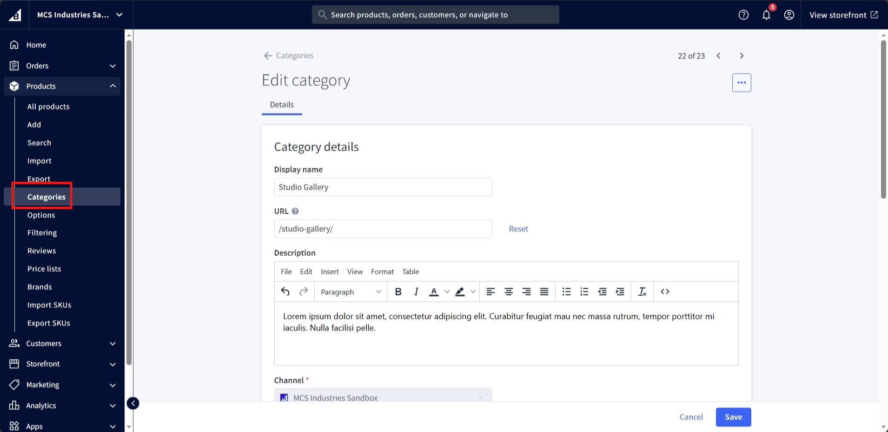

# Category Page
The category page lists all the products in the category.

## Banner

Navigate to <a href="https://store-pyabsa1eqo.mybigcommerce.com/manage/products/categories">category section</a> on the bigcommerce dashboard, and select the category to edit:

Scroll of the category image section:

Click the three dots to change or delete category banner image.

Save to publish changes.

## Title and Description
It contains the category name and description.

We used the built-in BigCommerce category settings for this.

To edit it, go to the category settings in BigCommerce.

## Filters
The filters are used to filter the products based on the price, brand, and other custom fields.

We used the built-in BigCommerce filters and custom fields for this.

You can see all the available filters going to the 'Filtering' settings in BigCommerce by selecting 'All filters'. You can then select the filters you want to show on the category page.

For more information about the filters, see the <a href="https://support.bigcommerce.com/s/article/Product-Filtering-Settings" target="_blank">BigCommerce documentation</a>.

## Products
It lists all the products in the category.

