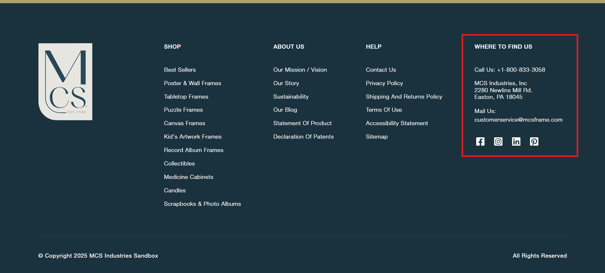
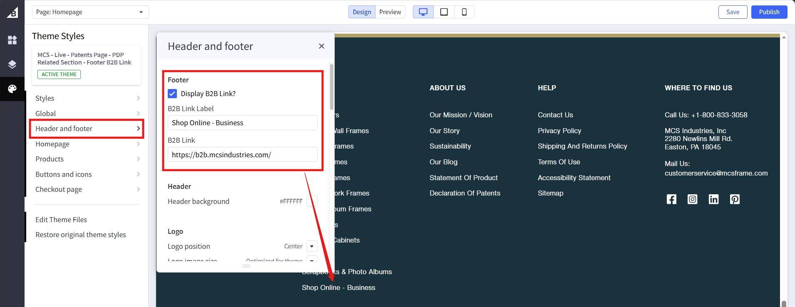

# Footer

## Navigation Links

1- First section is categories, and 2 sections on the right are webpages, as marked and labeled.

2- Navigation to categories section as marked in following screenshot in bigcommerce dashboard. Click on the respective item to edit name or link.

3- Navigation to webpages section as marked in following screenshot in bigcommerce dashboard. Click on the respective item to edit name or link.

## Call Us, Address, Mail

1- Navigate to this <a href="https://store-pyabsa1eqo.mybigcommerce.com/manage/settings/store-profile">page</a>.

2- Editing the marked will change the respective text.

## B2B Link

1- Navigate to the <a href="https://store-pyabsa1eqo.mybigcommerce.com/manage/page-builder?channelId=1">page builder</a>.

2- Save to preview and publish to push it to live.