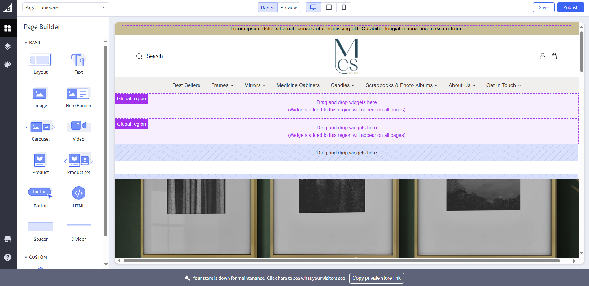

# Header

## Topbar

1- Navigate to the <a href="https://store-pyabsa1eqo.mybigcommerce.com/manage/page-builder?channelId=1">page builder</a>.

2- Click on the top bar, edit the text from the sidebar, click on save html and in order to publish, click publish.

## Navigation links

1- First 6 items are categories and last 2 are webpages.

2- Navigation to categories section as marked in following screenshot in bigcommerce dashboard. The first 6 items are displayed and in the same order, limited to 6 items. Click on the respective item to edit name or link.

3- Navigation to webpages section as marked in following screenshot in bigcommerce dashboard. The first 2 <strong>visible</strong> items are displayed and in the same order, limited to 2 items. Click on the respective item to edit name or link.

## B2B Link

1- Navigate to the <a href="https://store-pyabsa1eqo.mybigcommerce.com/manage/page-builder?channelId=1">page builder</a> and edit the following marked area with the desired changes:

2- Save to preview and publish to push it to live.