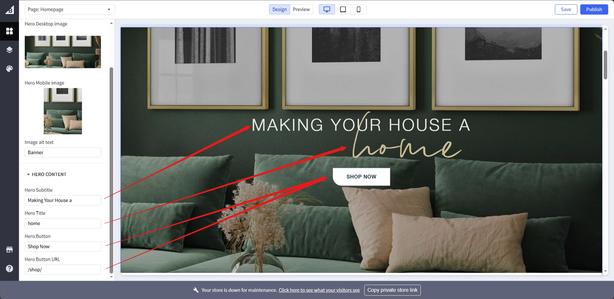
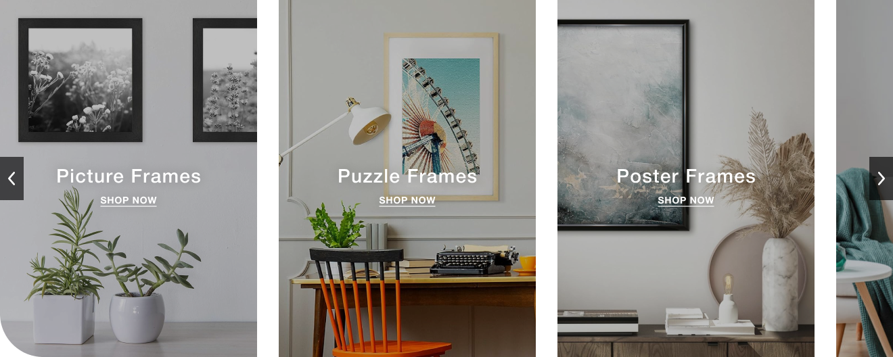
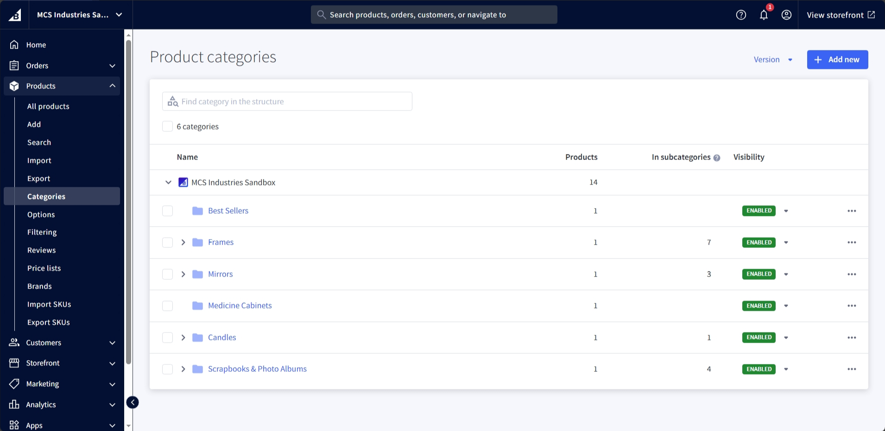
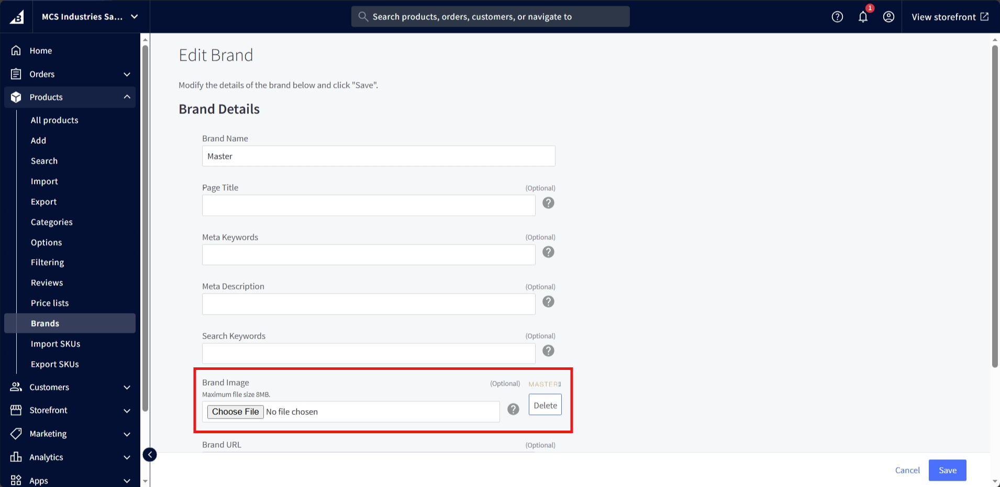
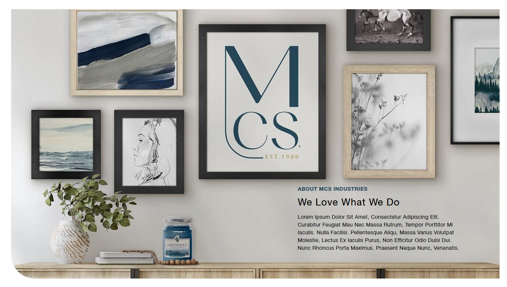
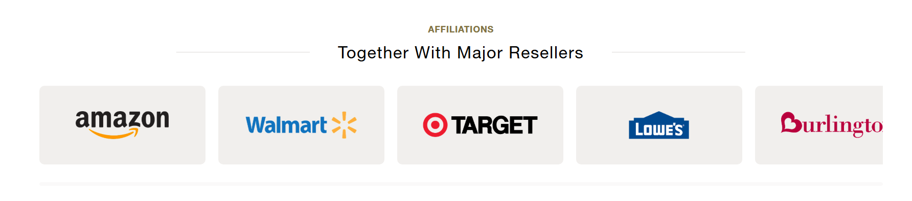
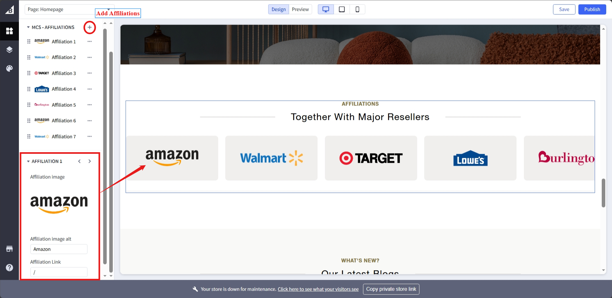
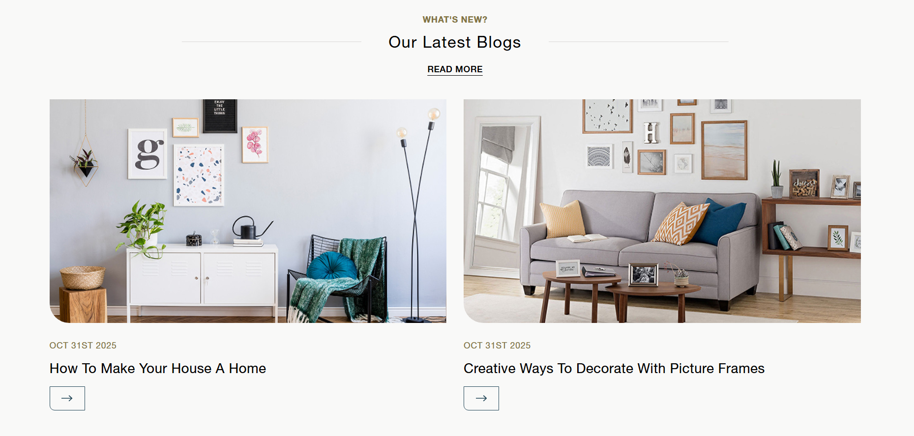

# Homepage
The homepage is the main page of the website. It is the first page that the user sees when they visit the website.

## Hero Banner

Navigate to the <a href="https://store-pyabsa1eqo.mybigcommerce.com/manage/page-builder?channelId=1">page builder</a>, and click on the banner which will display the banner options, change the banner images through following option and easily switch between layouts:

Easily change banner content through following options:

Click publish button to save changes.

## Featured Categories 
<strong>Note: Only subcategories with an image will be shown.</strong>

Navigate to the <a href="https://store-pyabsa1eqo.mybigcommerce.com/manage/products/categories">product categories</a>, expand the frames category, currently its setup to showcase subcategories of only frame category:

Click on one of the category:

Add or change category image by scrolling to following marked area:

Save the changes.

## Featured Brands
<strong>Note: Only brands with an image will be shown.</strong>

Navigate to the </a href="https://store-pyabsa1eqo.mybigcommerce.com/manage/products/brands">product brands</a>. It shows list of all brands on the store, select one of the brands by clicking it.

Add or change category image by scrolling to following marked area:

Save the changes.

## About Us

Navigate to the <a href="https://store-pyabsa1eqo.mybigcommerce.com/manage/page-builder?channelId=1">page builder</a>, and click on the about us banner which will display the banner options. Change the banner images through following option and easily switch between layouts:

Publish to save changes.

## Reviews

Navigate to the <a href="https://store-pyabsa1eqo.mybigcommerce.com/manage/page-builder?channelId=1">page builder</a> and scroll down to the reviews section and click it to display the options. Add, remove and edit reviews as displayed/marked in following screenshot:

Some additional settings along with option to change background:

Publish to save changes.

## Affiliations

Navigate to the <a href="https://store-pyabsa1eqo.mybigcommerce.com/manage/page-builder?channelId=1">page builder</a> and scroll down to the affiliations section and click it to display the options. Add, remove and edit affiliations as displayed/marked in following screenshot:

Add, remove and edit affiliations as displayed/marked in following screenshot:

Additional settings to change title and subtitle:

Publish to save changes.

## Blogs

Navigate to the blog page, only the latest published 2 blogs will be displayed. Click one of the blog to display list of options:

One of the options allows to add an image to the blog, note only the blogs having images are displayed:

Click update/save to save changes.