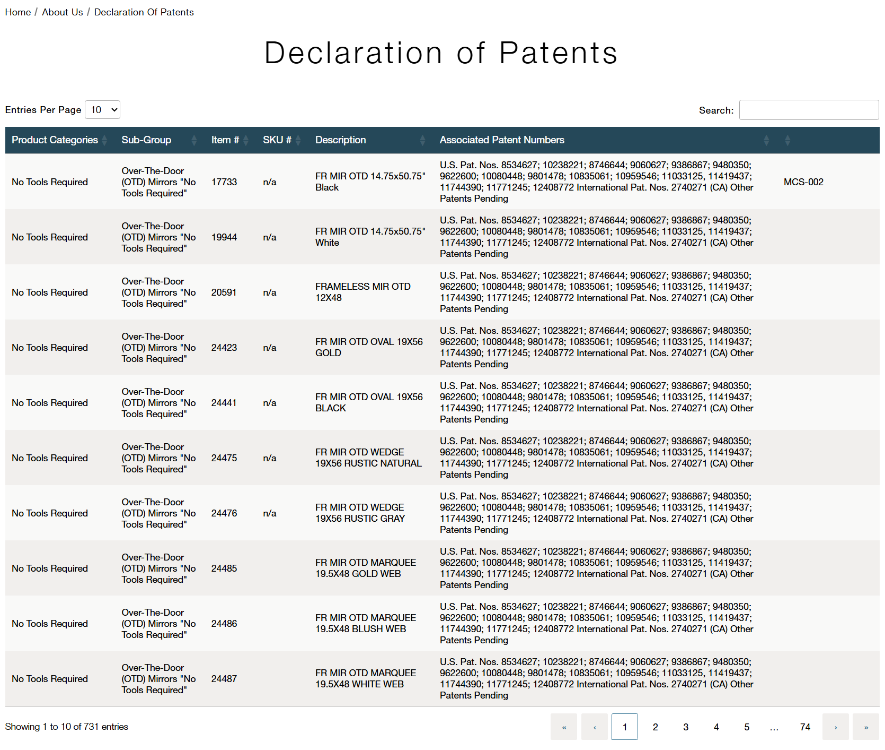
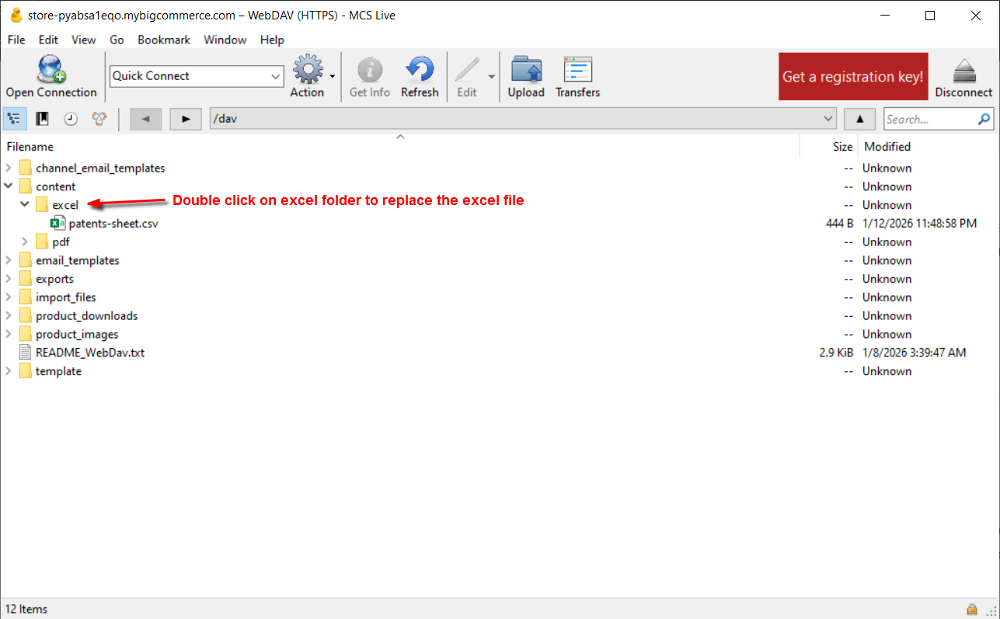
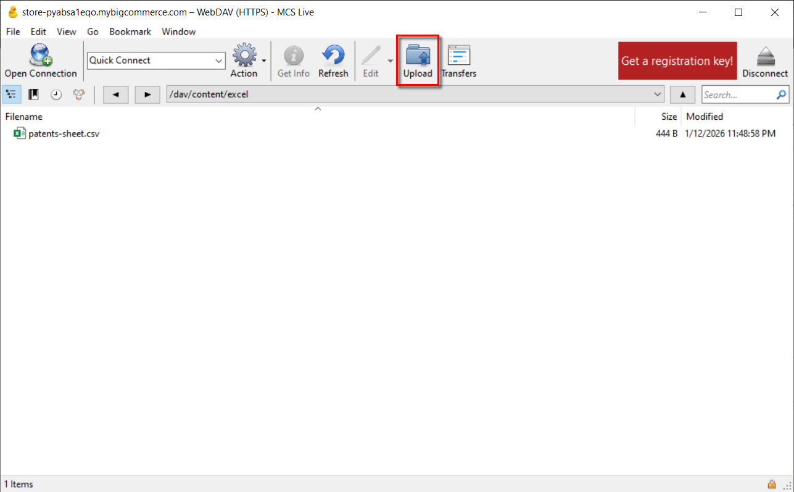

# Patents

#### Note:

Please make sure following template is select under patent:

Template Layout File - patents - Live store - <a href="https://store-pyabsa1eqo.mybigcommerce.com/manage/channel/1/pages/12/edit">Patents Page BC Link</a>

## Steps to update the data / table, for both sandbox and live store:

1. Enable and connect webdav by following the linked document.
2. Navigate to the excel folder as shared below:

4. Upload through the marked button, please make sure to follow the requirement of keeping the new file name as patents-sheet.csv, we can either delete the existing/old file or rename it to patents-sheet-1.csv by appending a number in case we feel like keeping a track or backup of old files.

6. Once uploaded, the table will update automatically, no further steps required.