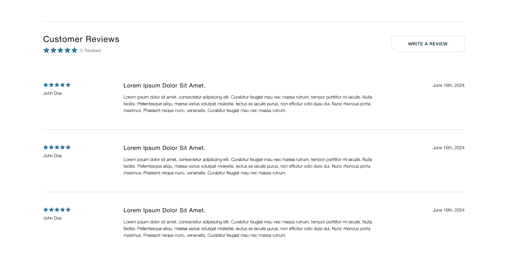

# Product Page
The product page displays the information about the product. It includes the product name, description, price, options, and an image of the product.

Most of the product page is built with the default BigCommerce settings, for more information regarding how to add a product in Bigcommerce, refer to this <a href="https://support.bigcommerce.com/s/article/Products-Overview?language=en_US" target="_blank">documentation</a>

There are some parts on the product page that need to follow specific guidelines.

## Customer Reviews

BigCommerce allows to easily manage product reviews by approving, editing, or deleting them through the dashboard. 
Please refer to the BigCommerce <a href="https://support.bigcommerce.com/s/article/Managing-Reviews?language=en_US" target="_blank">documentation</a> for more details.