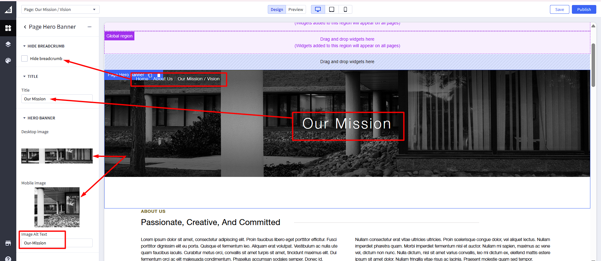
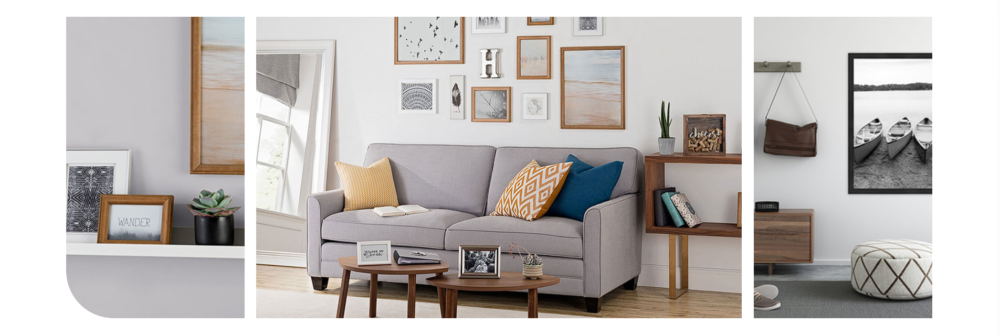
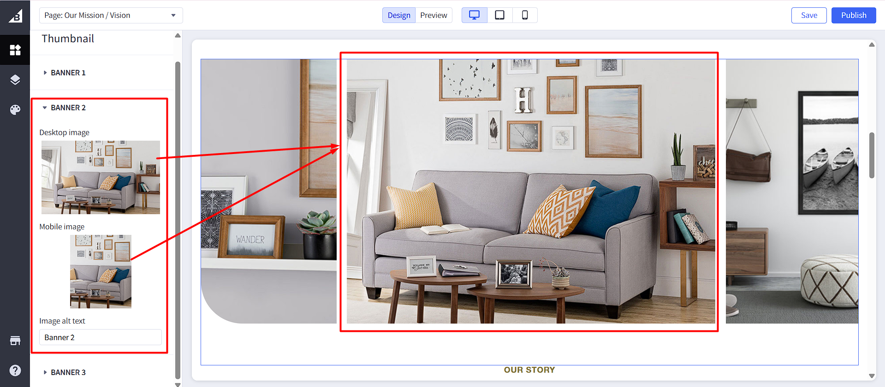
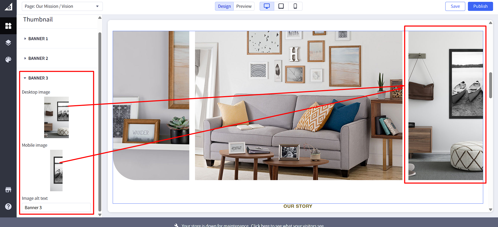
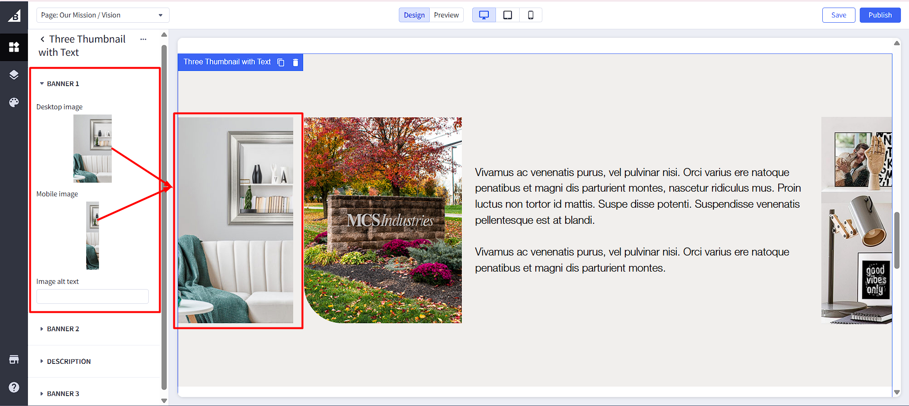
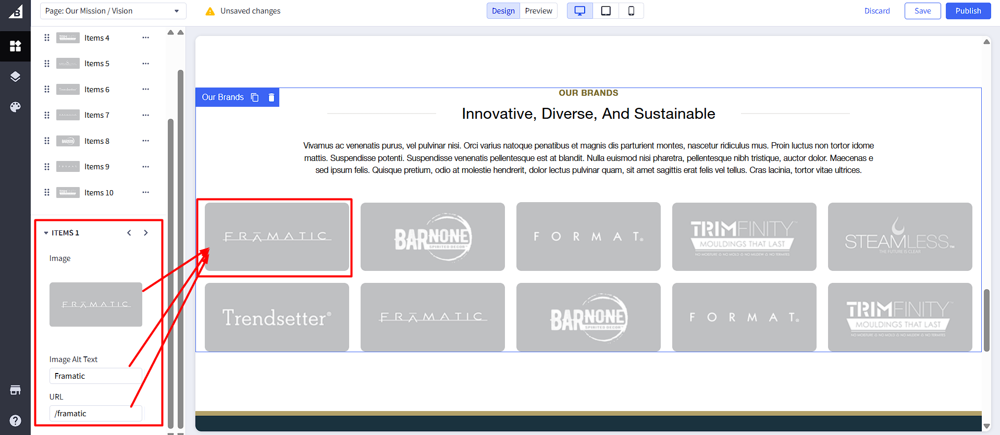
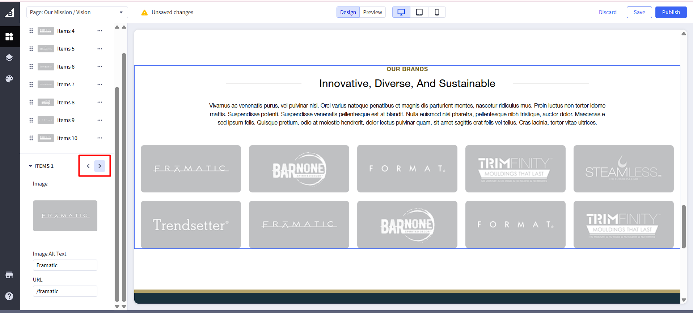

# Static Page

## Hero Banner Section

1. This section is made using a custom widget called `Page Hero Banner`. You can change the content in the [Page Builder](index.md/#page-builder).

2. You can change the text by clicking on it and changing the settings on the left panel. You can change the image, text and hide breadcrumb.

3. Click on the `Save` (to preview the changes) Or `Publish` (to make them live) button.

## About Us Section

1. This section is made using a custom widget called `Two Col Text`. You can change the content in the [Page Builder](index.md/#page-builder)

2. You can change the text by clicking on it and changing the settings on the left panel. You can change the title, subtitle and description.

3. Click on the `Save` (to preview the changes) Or `Publish` (to make them live) button.

## Three Thumbnail Section

1. This section is made using a custom widget called `Three Thumbnail`. You can change the content in the [Page Builder](index.md/#page-builder)

2. You can change the image by clicking on it and changing the settings on the left panel. You can change the text and image alt text.

3. Click on the `Save` (to preview the changes) Or `Publish` (to make them live) button.

## Our Story Section

1. This section is made using a custom widget called `Two Col Text`. You can change the content in the [Page Builder](index.md/#page-builder)

2. You can change the text by clicking on it and changing the settings on the left panel. You can change the title, subtitle and description.

3. Click on the `Save` (to preview the changes) Or `Publish` (to make them live) button.

## Thumbnail with Text Section

1. This section is made using a custom widget called `Three Thumbnail with Text`. You can change the content in the [Page Builder](index.md/#page-builder)

2. You can change the text by clicking on it and changing the settings on the left panel. You can change the images and description.

3. Click on the `Save` (to preview the changes) Or `Publish` (to make them live) button.

## Our Brands Section

1. This section is made using a custom widget called `Our Brands`. You can change the content in the [Page Builder](index.md/#page-builder)

2. You can change the logo by clicking on it and changing the settings on the left panel. You can change the logo, alt text and URL.

3. Use the plus `+` icon to add new items, and the `< and >` arrow icons to navigate and adjust individual item settings as needed.

4. By clicking on the ellipsis on the top right corner of the left panel, you can change the section settings, like title, and style.

5. Click on the `Save` (to preview the changes) Or `Publish` (to make them live) button.

